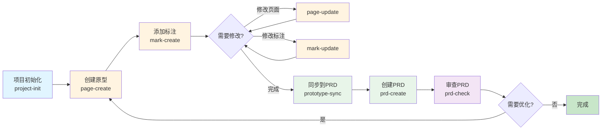

<div align="center">
  
  
  # PRDkit Skills
  
  <p>Claude Code skills 集合，用于增强 prdkit 产品管理工具的使用体验</p>
  <p>让 Claude 更智能地协助产品经理完成 PRD 编写、原型创建、标注管理等日常工作</p>
</div>

## 🔄 典型工作流程



## 📦 包含的 Skills

| 阶段 | Skill | 功能描述 | 使用场景 |
|------|-------|----------|----------|
| **第一步：项目初始化** | [prdkit-project-init](prdkit-project-init/) | 初始化产品项目，引导产品经理完成项目配置 | 创建新的产品项目、初始化 prdkit 工作空间 |
| **第二步：原型设计** | [prdkit-page-create](prdkit-page-create/) | 创建原型页面，支持移动端和 PC 端<br/>• 智能判断需求复杂度<br/>• 支持快速模式 | 搭建移动端原型、创建 PC 后台原型、生成页面原型 |
| | [prdkit-mark-create](prdkit-mark-create/) | 为原型元素创建标注说明<br/>• 分析元素上下文<br/>• 结构化提问明确标注内容 | 从 viewer 复制元素后创建标注、记录交互逻辑和功能说明 |
| | [prdkit-page-update](prdkit-page-update/) | 修改原型页面，支持样式、交互、数据修改<br/>• 自动创建 checkpoint 版本 | 修改页面元素、更新交互逻辑、调整页面样式 |
| | [prdkit-mark-update](prdkit-mark-update/) | 修改原型标注内容，记录需求变更 | 更新标注说明、修正标注错误、补充标注细节 |
| **第三步：PRD 编写** | [prdkit-prototype-sync](prdkit-prototype-sync/) | 将原型更新同步回 PRD 文档<br/>• 自动定位 PRD 和原型<br/>• 对比差异后更新 PRD | 原型完成后反哺 PRD、同步标注内容到需求文档 |
| | [prdkit-prd-create](prdkit-prd-create/) | 创建产品需求文档（PRD），支持高/中/低复杂度需求<br/>• 两阶段流程：先生成方案稿，确认后生成正式 PRD<br/>• 自动完成产品定型与复杂度判断 | 编写新的 PRD 文档、生成需求文档初稿、整理产品方案 |
| **第四步：审查优化** | [prdkit-prd-check](prdkit-prd-check/) | 审查 PRD 文档质量，按 14 个维度输出改进建议<br/>• 需求背景、目标用户、功能描述<br/>• 交互流程、数据模型、异常处理<br/>• 性能要求、安全性、可测试性等 | Review PRD 文档、检查需求完整性、发现潜在问题和风险 |

## 🚀 快速开始

### 安装 Skills

#### 方式一：使用 npx 安装（推荐）

```bash
# 安装所有 skills
npx skills add qizhi2design-svg/prdkit-skills -a claude-code -s '*' -y

# 或者选择性安装特定 skill
npx skills add qizhi2design-svg/prdkit-skills --list
```

**安装选项说明**：
- `-g, --global`: 全局安装
- `-a, --agent`: 指定 agent 类型（claude-code 或 codex）
- `-s, --skill`: 选择特定 skill（使用 `'*'` 安装全部）
- `-y, --yes`: 跳过确认提示

#### 方式二：手动安装

1. 克隆仓库到本地：
```bash
git clone https://github.com/qizhi2design-svg/prdkit-skills.git
cd prdkit-skills
```

2. 将 skills 目录添加到 Claude Code 的 skills 路径：
```bash
# 方法 1: 复制到 Claude Code 的 skills 目录
cp -r prdkit-* ~/.claude/skills/

# 方法 2: 创建符号链接
ln -s $(pwd)/prdkit-* ~/.claude/skills/
```

3. 重启 Claude Code 或重新加载 skills

### 使用 Skills

Skills 会根据你的对话内容自动触发。例如：

```
你: 帮我写一个用户登录功能的 PRD
Claude: [自动使用 prdkit-prd-create skill]

你: 我从 viewer 复制了这个按钮的信息：<button class="submit">提交</button>
Claude: [自动使用 prdkit-mark-create skill]

你: 帮我 review 一下这个 PRD
Claude: [自动使用 prdkit-prd-check skill]
```

## 📖 Skill 详细说明

每个 skill 目录包含：
- `SKILL.md` - Skill 的详细说明和使用指南
- `references/` - 参考文档（如果有）
- `scripts/` - 辅助脚本（如果有）

查看具体 skill 的使用方法：
```bash
cat prdkit-prd-create/SKILL.md
```

## 🛠️ 开发

### 项目结构

```
prdkit/skills/
├── prdkit-project-init/     # 项目初始化
├── prdkit-prd-create/       # PRD 创建
├── prdkit-prd-check/        # PRD 审查
├── prdkit-page-create/      # 原型创建
├── prdkit-page-update/      # 原型修改
├── prdkit-mark-create/      # 标注创建
├── prdkit-mark-update/      # 标注修改
└── prdkit-prototype-sync/   # 原型同步
```

### 修改 Skills

1. 编辑对应的 `SKILL.md` 文件
2. 测试修改后的 skill
3. 提交更改

### 测试 Skills

使用 skill-creator 进行评测：
```bash
# 在 Claude Code 中
/skill-creator evaluate <skill-name>
```

## 🤝 贡献

欢迎提交 Issue 和 Pull Request！

### 贡献指南

1. Fork 本仓库
2. 创建特性分支 (`git checkout -b feature/amazing-skill`)
3. 提交更改 (`git commit -m 'Add amazing skill'`)
4. 推送到分支 (`git push origin feature/amazing-skill`)
5. 创建 Pull Request

## 📝 License

本项目采用 MIT 许可证 - 详见 [LICENSE](LICENSE) 文件

## 🔗 相关项目

- [prdkit CLI](https://github.com/qizhi2design-svg/prdkit) - prdkit 命令行工具
- [create-prd-skill](https://github.com/pmYangKun/create-prd-skill) - B端 PRD 生成工具
- [tapd-skills](https://github.com/qizhi2design-svg/tapd-skills) - TAPD 需求协作 skills

## 📮 反馈

如有问题或建议，请提交 [Issue](https://github.com/qizhi2design-svg/prdkit-skills/issues)。
