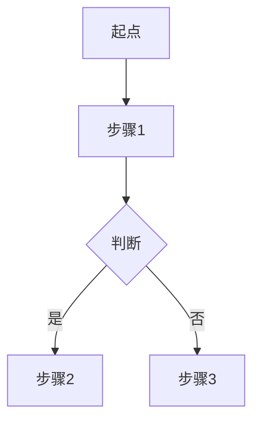

# 第二阶段：结构确认

这些模板用于在正式实现前快速确认信息结构。请把示例标签替换成当前业务领域里的实际文案。

## 移动端

```text
+--------------------------------------------------+
| 状态栏 / 时间                         搜索/操作 |
+--------------------------------------------------+
| 页面标题                                        |
| 副标题 / 当前状态                               |
+--------------------------------------------------+
| Tab A        | Tab B        | Tab C             |
+--------------------------------------------------+
| 核心卡片 / 概览 / 关键操作                      |
| - 主指标                                        |
| - 辅助说明                                      |
| [主按钮 CTA]                                    |
+--------------------------------------------------+
| 模块标题                              更多 >    |
| [内容卡片]                                      |
| [内容卡片]                                      |
| [内容卡片]                                      |
+--------------------------------------------------+
| 底部导航: 首页 | 任务 | 消息 | 我的             |
+--------------------------------------------------+
```

交互说明应至少覆盖：

- 入口路径
- 默认 tab 及原因
- 主要操作
- 滚动方式
- 空状态 / 加载态 / 错误态（必须绘制对应的线框图）
- 状态管理（如有 tab 切换、筛选、展开折叠等）

## PC 后台

```text
+--------------------------------------------------------------------------------+
| Logo | 产品名称                         搜索          通知   用户   设置        |
+--------------------------------------------------------------------------------+
| 菜单 1        | 面包屑 / 页面标题                                      CTA     |
| 菜单 2        +---------------------------------------------------------------+
| 菜单 3        | 筛选项 A  筛选项 B  日期范围                [查询][重置]      |
| 菜单 4        +---------------------------------------------------------------+
|               | KPI 卡片 | KPI 卡片 | KPI 卡片 | KPI 卡片                    |
|               +---------------------------------------------------------------+
|               | 表格 / 图表 / 工作台主体区域                                 |
|               | ------------------------------------------------------------- |
|               | 行数据                                                        |
|               | 行数据                                                        |
|               | 行数据                                                        |
|               +---------------------------------------------------------------+
```

交互说明应至少覆盖：

- 默认进入模块
- 筛选项之间的联动关系
- 单行操作与批量操作
- 权限敏感操作
- 刷新与分页方式
- 状态管理（筛选条件、选中项、展开折叠等）
- 空状态 / 加载态 / 错误态（必须绘制对应的线框图）

## 业务流程图

使用 Mermaid 绘制业务主要流程，帮助理解页面在整个业务流程中的位置和作用。

### 流程图类型

- **flowchart**：线性流程和分支判断
- **stateDiagram**：状态流转（审批、工单等）
- **sequenceDiagram**：多角色交互时序

### 绘制要点

- 明确起点、终点、关键决策点
- 突出权限判断、数据验证、异常处理
- 控制在 10 个节点以内
- 只画主流程，细节用文字说明

## 空状态与异常页

### 必须包含的元素
- 图标（Lucide Icons）
- 标题（5-8 字）
- 说明（15-30 字）
- 操作按钮（如适用）

### 图标选择
- 空状态：`inbox`、`file-text`
- 加载中：`loader`
- 错误：`alert-circle`、`x-circle`
- 权限受限：`lock`
- 网络错误：`wifi-off`

### 示例文案

| 场景 | 标题 | 说明 | 按钮 |
|------|------|------|------|
| 列表为空 | 暂无数据 | 还没有创建任何内容 | 立即创建 |
| 搜索无结果 | 未找到相关内容 | 试试调整搜索关键词 | 清空筛选 |
| 加载失败 | 加载失败 | 网络连接异常，请重试 | 重新加载 |
| 权限不足 | 暂无访问权限 | 请联系管理员开通权限 | 返回首页 |

## 状态管理说明

原型页面的状态管理应遵循以下原则：

### 状态分类

**页面级状态**
- 当前 tab / 视图模式
- 筛选条件（搜索关键词、日期范围、状态筛选等）
- 分页信息（当前页码、每页条数）
- 排序方式

**组件级状态**
- 列表项的选中状态（单选 / 多选）
- 展开折叠状态（手风琴、树形结构）
- 弹窗 / 抽屉的显示隐藏
- 表单输入值

**数据状态**
- 加载中（loading）
- 加载成功（loaded）
- 加载失败（error）
- 空数据（empty）

### 状态存储位置

统一存储在 `mock.js` 的 `mockData.state` 对象中

### 状态更新规则

- `script.js` 只读取和更新 `mockData.state`
- 状态变化后通过 `render()` 重新渲染
- 保持单一数据源

## 在方案文档中记录

将 ASCII 线框图、业务流程图和交互说明添加到 `draft/reference/<title>-prototype-plan.md`：

```md
## 业务流程图



**流程说明**
- 起点：
- 关键决策点：
- 终点：
- 异常处理：

## ASCII 布局图

### 正常状态
```text
<wireframe>
```

### 空状态
```text
<empty state wireframe>
```

### 加载态
```text
<loading state wireframe>
```

### 错误态
```text
<error state wireframe>
```

## 交互说明
- 入口路径：
- 默认状态：
- 主要操作：
- 空状态：
- 加载态：
- 错误态：

## 状态管理
- 页面级状态：（tab、筛选、分页等）
- 组件级状态：（选中、展开、弹窗等）
- 状态存储位置：mockData.state
- 关键状态流转：（描述主要的状态变化逻辑）
```
